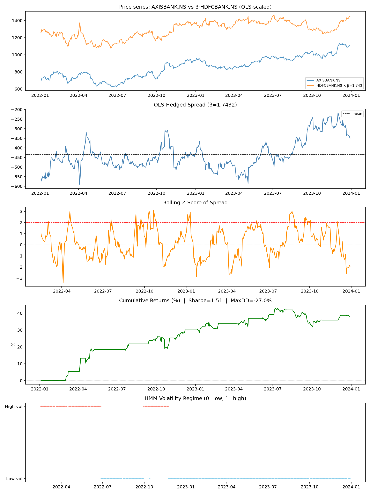

# Machine Learning Enhanced Statistical Arbitrage System

A quantitative trading framework that combines cointegration screening, machine learning pair selection, regime detection, and transaction-cost-aware backtesting to evaluate statistical arbitrage opportunities in equity markets.

## Project Overview

Traditional pairs trading strategies rely on identifying cointegrated assets whose price relationship exhibits mean-reverting behavior. While effective in theory, such approaches often suffer from false discoveries, unstable relationships, and changing market conditions.

This project extends classical statistical arbitrage by integrating:

* Cointegration testing using the Engle-Granger framework
* Benjamini-Hochberg False Discovery Rate correction
* Machine learning-based pair ranking
* Market regime detection
* Transaction-cost-aware backtesting
* Time-series-aware model validation

The objective is to determine whether statistical features and machine learning can improve pair selection and trading performance.

---

## Methodology

### 1. Cointegration Screening

All possible stock pairs are evaluated using the Engle-Granger cointegration test.

To reduce false positives resulting from multiple hypothesis testing, p-values are adjusted using the Benjamini-Hochberg False Discovery Rate (FDR) procedure.

### 2. Feature Engineering

For each candidate pair, the framework computes:

* Rolling correlation
* Rolling volatility
* Spread z-score
* Hurst exponent
* Ornstein-Uhlenbeck half-life
* Mean-reversion characteristics

These features capture both equilibrium stability and short-term market behavior.

### 3. Machine Learning Pair Selection

A Random Forest classifier is trained using time-series-aware cross-validation (TimeSeriesSplit).

The model ranks candidate pairs according to their estimated probability of profitability.

### 4. Regime Detection

Market environments are classified using volatility-based clustering.

This allows strategy performance to be analyzed across different market regimes.

### 5. Backtesting

The strategy incorporates:

* One-period execution lag
* Transaction costs
* Position tracking
* Portfolio equity evolution

to produce more realistic performance estimates.

---

## Dataset

Universe:

* AXISBANK.NS
* HDFCBANK.NS
* ICICIBANK.NS
* KOTAKBANK.NS

Sample:

* 493 trading days
* 4 stocks
* 6 possible candidate pairs

---

## Results

### Cointegration Screening

| Metric                                        | Value |
| --------------------------------------------- | ----- |
| Candidate Pairs Tested                        | 6     |
| Pairs Surviving Benjamini-Hochberg Correction | 0     |

No pairs remained statistically significant after False Discovery Rate correction at the 5% significance level.

Rather than forcing a cointegration-based trade, the framework selected the highest-ranked machine learning candidate pair for evaluation.

---

### Machine Learning Performance

The Random Forest model was trained using a 70/30 time-based train-test split and TimeSeriesSplit cross-validation.

| Metric                    | Value |
| ------------------------- | ----- |
| Best Cross-Validation AUC | 0.650 |
| Out-of-Sample AUC         | 0.637 |
| Out-of-Sample Accuracy    | 62.2% |

Top-ranked candidate pairs:

| Pair                       | Probability of Profitability |
| -------------------------- | ---------------------------- |
| AXISBANK.NS – HDFCBANK.NS  | 80.8%                        |
| HDFCBANK.NS – ICICIBANK.NS | 76.2%                        |
| HDFCBANK.NS – KOTAKBANK.NS | 67.8%                        |

---

### Trading Performance

Selected Pair:

**AXISBANK.NS – HDFCBANK.NS**

Estimated hedge ratio:

β = 1.7432

Spread definition:

AXISBANK − 1.7432 × HDFCBANK

Performance metrics:

| Metric                | Value  |
| --------------------- | ------ |
| Total Return          | 37.8%  |
| Annualized Return     | 17.9%  |
| Annualized Volatility | 11.8%  |
| Sharpe Ratio          | 1.51   |
| Maximum Drawdown      | -27.0% |
| Calmar Ratio          | 0.66   |

The strategy generated a cumulative return of 37.8% over the testing period while achieving a Sharpe ratio above 1.5 under transaction-cost and execution-lag assumptions.

---

### Regime Analysis

Since Hidden Markov Models were unavailable in the environment, volatility regimes were identified using K-Means clustering.

| Regime          | Total Return | Annualized Sharpe |
| --------------- | ------------ | ----------------- |
| Low Volatility  | 15.1%        | 1.08              |
| High Volatility | 22.6%        | 2.87              |

The strategy exhibited substantially stronger risk-adjusted performance during higher-volatility environments, suggesting that spread dislocations and subsequent mean reversion opportunities were more pronounced during these periods.

---

## Equity Curve

Final cumulative return: **37.79%**

---

## Technologies

* Python
* Pandas
* NumPy
* SciPy
* Statsmodels
* Scikit-Learn
* Matplotlib

---

## Future Improvements

Potential extensions include:

* Walk-forward validation
* Dynamic hedge ratios using Kalman Filters
* XGBoost and LightGBM models
* Portfolio-level optimization
* Sector-neutral portfolio construction
* Hidden Markov Model regime detection
* Live trading integration

---

## Disclaimer

This project is intended solely for educational and research purposes and should not be interpreted as investment advice.
